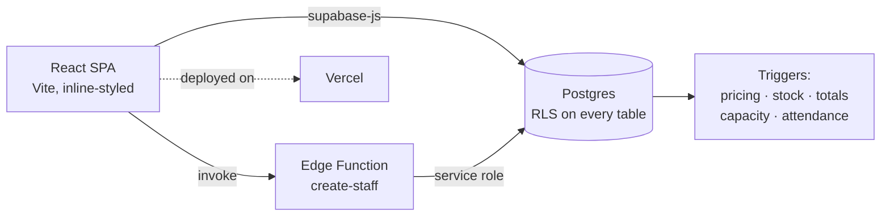

# VenueOS

**Hospitality management platform** — point of sale, inventory, reservations, staff and reporting for bars, restaurants and cafés. Built end-to-end: React frontend, Postgres backend with row-level security, deployed to production.

**▶ Live demo:** [venueos-demo.vercel.app](https://venueos-demo.vercel.app) — click **"View demo (one click)"**, no signup needed. Loaded with 3 months of generated trading data.

---

## Features

**Point of sale**
- Tap-through menu (category → liquor type → item), cart with per-line quantities
- Bill math: service charge + PB1 tax (Indonesian convention), computed server-side to prevent tampering
- Cash / card / QRIS payment, cash-received input with change calculation
- Receipts with full line detail, searchable by day, customer name, or staff name

**Inventory (bar-native)**
- Whole-bottle tracking: cocktails don't decrement stock; staff log "bottle finished" instead — the model small bars actually maintain
- Waste tracking with reasons (spillage / breakage / expired), costed at weighted-average bottle cost
- Deliveries with automatic weighted-average cost recalculation
- Low-stock reorder list

**Operations**
- Reservations with live seat-availability check (overlap-aware, enforced by a DB trigger against race conditions)
- Returning-customer lookup by phone number
- Expense log, cash ledger, P&L-style dashboard with 12-month revenue chart (hand-rolled SVG, no chart library)
- CSV exports: sales, cash flow, expenses, inventory valuation

**Team**
- Owner/staff roles: staff see only operational screens; money and reports are owner-only
- Staff onboarding from inside the app via a Supabase Edge Function (service key never ships to the client)
- Attendance: automatic clock-in on login, clock-out on sign-out, immutable once closed; per-day and per-person history

## Security model

Access control is enforced **in the database**, not just the UI — every table has Postgres row-level security:

| | Staff | Owner |
|---|---|---|
| Record sales / restocks / bookings | ✓ (own, attributed) | ✓ |
| See revenue, costs, reports, capital | ✗ | ✓ |
| Edit menu, products, staff | ✗ | ✓ |
| Falsify attendance times | ✗ (immutable by trigger) | ✗ |
| Deactivated account, direct API | ✗ (`is_active()` in every policy) | — |

Additional hardening: sale prices and bill totals recomputed by triggers (client values ignored), negative-stock guard, booking-capacity trigger, public signups disabled, one-shot attendance closure.

## Architecture



- **Frontend:** React 19 + Vite, no UI framework — layout, charts and icons hand-built
- **Backend:** Supabase (Postgres + Auth + Edge Functions); business rules live in SQL triggers so they hold regardless of client
- **Two deployments, one codebase:** private production instance and this public demo, switched by env vars

## Run locally

```bash
npm install
cp .env.example .env.local   # add your Supabase URL + anon key
npm run dev
```

Database: run [`db/demo-schema.sql`](db/demo-schema.sql) on a fresh Supabase project (tables, triggers, policies), then optionally [`db/demo-seed.sql`](db/demo-seed.sql) for sample data. `npm test` runs the unit tests; CI runs lint + tests + build on every push.

## Honest notes

- Built solo as a learning project with AI-assisted development; every architectural decision, security policy and iteration reviewed and understood by me
- History starts at "already working" because the project outgrew its first throwaway repo — the [`db/`](db) folder documents the schema's full evolution
- Known gaps I'd tackle next: open tabs (order-now-pay-later), void/refund with audit trail, stocktake reconciliation, offline queue
